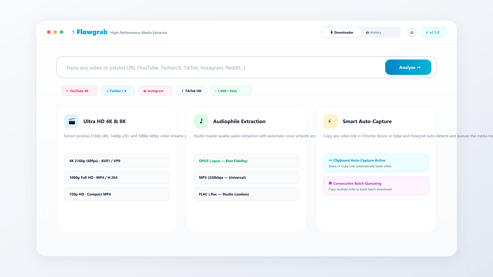
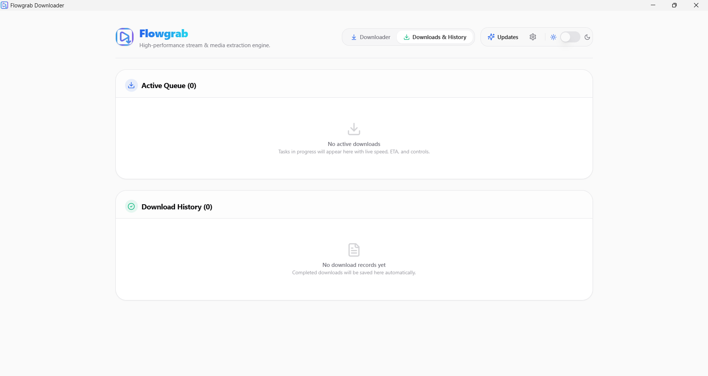
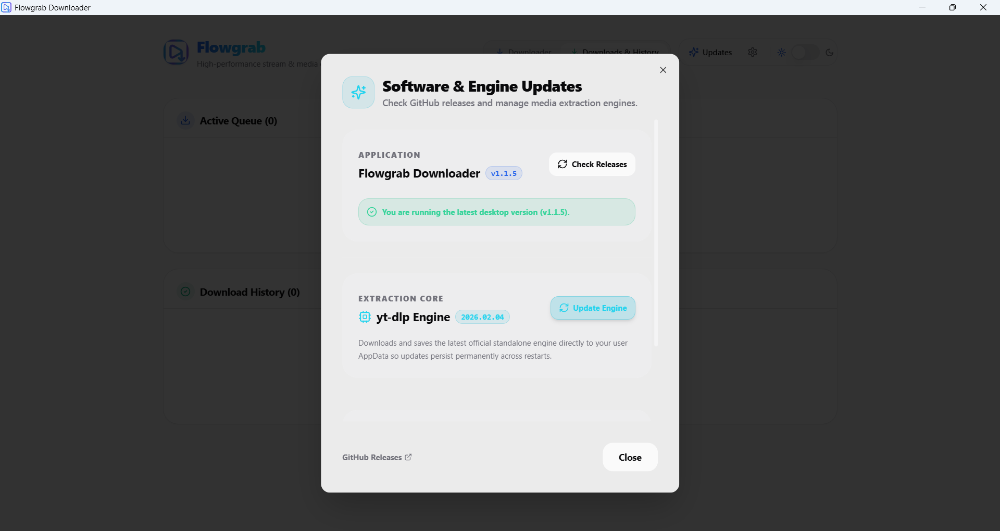
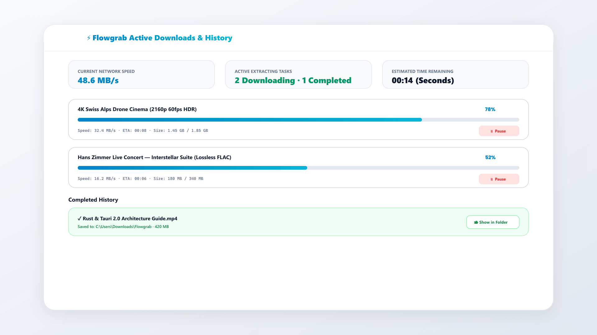
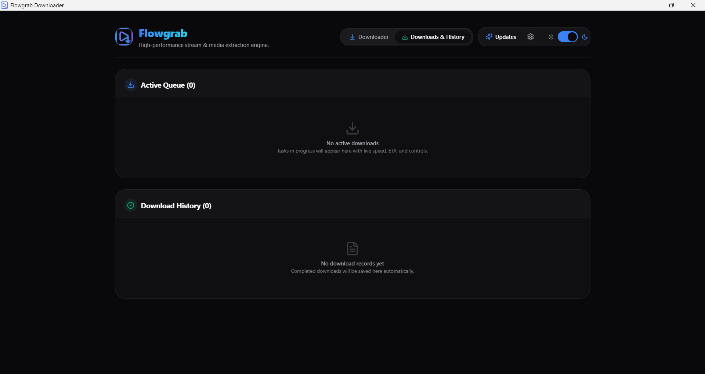

# ⚡ Flowgrab Downloader (v1.1.4)

A modern, high-performance, privacy-first desktop application for downloading videos, audio, and playlists from virtually any web platform, built with **Tauri v2**, **Next.js 15**, **React 19**, **yt-dlp**, and **FFmpeg**.

[](https://github.com/HrshD1eux/Flowgrab_Downlaoder)
[](https://github.com/HrshD1eux/Flowgrab_Downlaoder/releases)
[](https://github.com/yt-dlp/yt-dlp)
[](https://ffmpeg.org/)
[](https://tauri.app/)
[](README.md#license)

---

## 📸 Screenshots

| ⚡ Main Downloader Interface (Light) | 🎬 4K Stream & Codec Selector |
| :---: | :---: |
|  |  |

| 📑 Smart Batch Queue Manager | 📦 Active Downloads & Speed Monitor |
| :---: | :---: |
|  |  |

| ✨ 1-Click In-App Background Auto-Updater |
| :---: |
|  |

---

## ✨ Key Features

### 🌐 Smart Browser Integration & Auto-Capture
* **Clipboard Auto-Capture**: When enabled, clicking **Share $\rightarrow$ Copy Link** or copying any media URL (`Ctrl + C`) in Chrome, Brave, Edge, or Firefox immediately loads and analyzes the video inside Flowgrab with zero manual pasting.
* **Smart Consecutive Batch Queueing**: If a video is already loaded, copying subsequent links from your browser **automatically queues them into the Batch Download Manager**, letting you build a multi-video download queue on the fly.
* **Deep-Link Protocol (`flowgrab://<url>`)**: Supports native OS deep-linking. Use our 1-click browser bookmarklet to send any webpage's video directly to Flowgrab with a single click.

### 🎬 Universal Video & Audio Extraction
* **Complete Resolution Spectrum**: Download at any resolution from **4K Ultra HD (2160p)**, **2K (1440p)**, **1080p Full HD**, **720p HD**, **480p**, down to **360p** and **240p Data Saver**.
* **Audiophile Codec Extraction**: Extract pristine audio in **`.opus`** (Best quality & compression), **`.mp3`** (Universal compatibility, 320kbps), **`.m4a`** (Apple AAC), **`.flac`** (Lossless studio master), and **`.wav`** (Uncompressed PCM).
* **Metadata & Cover Art Embedding**: Automatically embed complete media tags (Title, Artist, Album, Date, Description) and high-resolution cover artwork directly inside the final `.mp4`, `.mkv`, `.mp3`, or `.m4a` files.
* **Universal Platform Compatibility**: Over 1,000+ supported sites including YouTube, Twitter / X, Instagram, TikTok, Reddit, Facebook, Vimeo, Twitch, and SoundCloud.

### ⚡ Blazing Performance & Process Engine
* **Single-Pass Extraction**: Fast URL inspection extracting complete video manifests and playlist entries in a single process pass.
* **Anti-Throttling Engine**: Built-in player client negotiation preventing HTTP 403 Forbidden errors and Cloudflare rate limits.
* **Instant Process Controls**: Responsive Pause, Resume, and Stop controls with clean process tree termination and human-readable error diagnostics.
* **Persistent In-App Updater**: Direct GitHub binary downloader streaming official updates in the background, ensuring new engine versions persist permanently across restarts.

### 🎨 Modern, Performance-Focused UI
* **Minimalist Slate/Zinc Theme**: Clean, distraction-free interface with instant Dark and Light mode switching.
* **Downloads & History Dashboard**: Real-time progress bars, live transfer speed (`MB/s`), time remaining (`ETA`), exact file destination paths, and **"Show in Folder"** navigation.
* **Full Settings Persistence**: Set default download directories, preferred video containers (`mp4`, `mkv`, `webm`), audio codecs, auto-thumbnail embedding, and auto-reset downloader on finish.

---

## 🚀 1-Click Browser Bookmarklet Setup

You can send any video from Chrome, Brave, Edge, or Firefox directly to Flowgrab with **one click**:

1. Open your browser's **Bookmarks Bar** (`Ctrl + Shift + B`).
2. Right-click the bar $\rightarrow$ **Add page / Add bookmark**.
3. Set Name to: `⚡ Send to Flowgrab`
4. Set URL to:
   ```javascript
   javascript:window.location.href='flowgrab://' + encodeURIComponent(window.location.href);
   ```
5. Whenever you are watching any video on YouTube, Twitter, Instagram, or TikTok, click the bookmark to open it in Flowgrab instantly!

---

## 🛠️ Development & Building

### Prerequisites
* **Node.js (v18+)**
* **Rust & Cargo (v1.77+)**
* **Tauri CLI (v2)**:
  ```bash
  cargo install tauri-cli --version "^2.0.0"
  ```

### 1. Clone & Install
```bash
git clone https://github.com/HrshD1eux/Flowgrab_Downlaoder.git
cd Video_Downloader
npm install
```

### 2. Run in Development
```bash
cargo tauri dev
```

### 3. Run Automated Tests
```bash
# Backend Rust Unit Tests
cargo test --manifest-path src-tauri/Cargo.toml

# Frontend TypeScript Validation
npm run typecheck
```

### 4. Build Production Installers
```bash
npm run build
cargo tauri build
```
The output installers will be generated under `src-tauri/target/release/bundle/`:
* **Windows**: `Flowgrab Downloader_1.1.4_x64-setup.exe` & `Flowgrab Downloader_1.1.4_x64_en-US.msi`
* **Linux**: `flowgrab_1.1.4_amd64.deb` & `flowgrab_1.1.4_amd64.AppImage`

---

## 📂 Architecture Overview

```
Flowgrab/
├── src/                      # Next.js 15 App Router Frontend
│   ├── app/                  # Layout, globals.css, main page & clipboard monitor
│   ├── components/           # UI components, DownloadsManager, SettingsModal, UpdateModal
│   └── lib/                  # Tauri IPC bindings & GitHub updater client
├── src-tauri/                # Rust Desktop Backend
│   ├── src/
│   │   ├── commands/         # download, video analysis, engine resolver, settings, updates, explorer
│   │   └── lib.rs            # Application state, plugins, flowgrab:// protocol, tray menu
│   ├── binaries/             # Bundled yt-dlp sidecar binary
│   ├── resources/            # Bundled FFmpeg muxing binaries
│   ├── tauri.conf.json       # Tauri bundle configuration & permissions
│   └── Cargo.toml            # Rust dependencies & metadata
└── package.json              # Frontend scripts & dependencies
```

---

## 👥 Credits & Attributions

This application is built on top of incredible open-source technologies and libraries. Sincere gratitude to the developers and maintainers of these projects:

* **[yt-dlp](https://github.com/yt-dlp/yt-dlp)** — The core media extraction engine (Released under [The Unlicense](https://unlicense.org/)).
* **[FFmpeg](https://ffmpeg.org/)** — The leading multimedia framework for audio extraction, muxing, and video stream conversions (Licensed under [LGPL v2.1+ / GPL v2+](https://www.gnu.org/licenses/old-licenses/lgpl-2.1.html)).
* **[Tauri](https://tauri.app/)** — Modern framework for building ultra-fast, lightweight desktop binaries with web frontends (Dual-licensed under MIT and Apache 2.0).
* **[Next.js](https://nextjs.org/)** by [Vercel](https://vercel.com/) — The React framework for high-performance frontend interfaces (Licensed under MIT).
* **[React](https://react.dev/)** by [Meta Open Source](https://opensource.fb.com/) — The foundation for dynamic UI state management (Licensed under MIT).
* **[Tailwind CSS](https://tailwindcss.com/)** by [Tailwind Labs](https://tailwindlabs.com/) — Utility-first styling system (Licensed under MIT).
* **[Lucide Icons](https://lucide.dev/)** — Beautiful & consistent open-source iconography (Licensed under ISC).
* **[Radix UI](https://www.radix-ui.com/)** by [WorkOS](https://workos.com/) — Unstyled, accessible UI component primitives (Licensed under MIT).

---

## ⚖️ Legal Disclaimer & Fair Use Notice

> [!IMPORTANT]
> **Please Read Before Use**:
> 1. **Personal & Fair-Use Purpose**: **Flowgrab Downloader** is designed strictly as a free, open-source utility for personal archiving, educational research, offline viewing of user-owned or Creative Commons media, and lawful fair use.
> 2. **Compliance with Laws & Terms**: The authors and contributors of this software do **not** encourage, condone, or facilitate copyright infringement, intellectual property violation, or the breach of third-party platforms' Terms of Service. Users are solely responsible for ensuring that their download and usage activities strictly comply with all applicable local, national, and international copyright laws and platform agreements.
> 3. **No Warranty / As-Is**: This software is provided *"as-is"* without warranty of any kind, express or implied. The developers disclaim any liability for improper, unauthorized, or illegal use of this tool.
> 4. **Trademarks**: All brand names, logos, platform trademarks (such as YouTube, Twitter, Instagram, TikTok, Facebook, etc.), and service marks referenced are the property of their respective trademark holders. Their mention is solely for identification and compatibility description purposes and does not imply endorsement or affiliation.

---

## 📜 License

```
MIT License

Copyright (c) 2026 HrshD1eux

Permission is hereby granted, free of charge, to any person obtaining a copy
of this software and associated documentation files (the "Software"), to deal
in the Software without restriction, including without limitation the rights
to use, copy, modify, merge, publish, distribute, sublicense, and/or sell
copies of the Software, and to permit persons to whom the Software is
furnished to do so, subject to the following conditions:

The above copyright notice and this permission notice shall be included in all
copies or substantial portions of the Software.

THE SOFTWARE IS PROVIDED "AS IS", WITHOUT WARRANTY OF ANY KIND, EXPRESS OR
IMPLIED, INCLUDING BUT NOT LIMITED TO THE WARRANTIES OF MERCHANTABILITY,
FITNESS FOR A PARTICULAR PURPOSE AND NONINFRINGEMENT. IN NO EVENT SHALL THE
AUTHORS OR COPYRIGHT HOLDERS BE LIABLE FOR ANY CLAIM, DAMAGES OR OTHER
LIABILITY, WHETHER IN AN ACTION OF CONTRACT, TORT OR OTHERWISE, ARISING FROM,
OUT OF OR IN CONNECTION WITH THE SOFTWARE OR THE USE OR OTHER DEALINGS IN THE
SOFTWARE.
```
